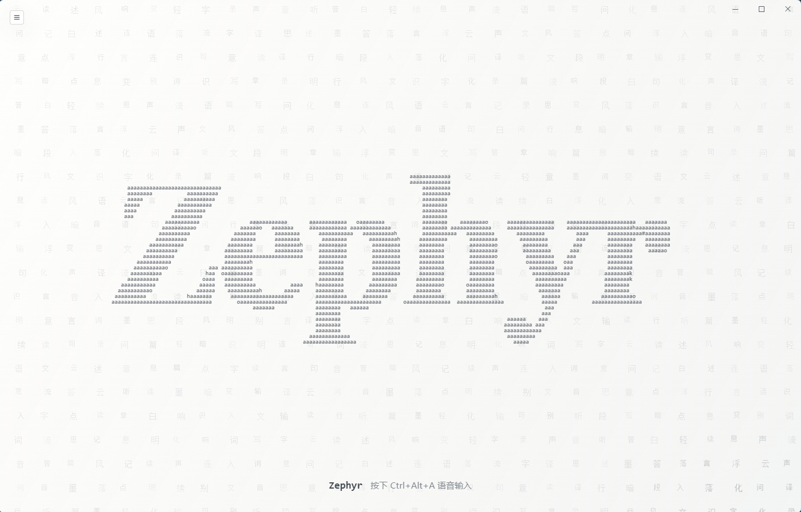

# Zephyr

Zephyr is a desktop AI voice input assistant built with Tauri 2, Rust, Preact, and TypeScript. Windows is the current usable product path; an Apple Silicon macOS path is being brought up in the same repository.

On Windows, Zephyr is not a TSF input method. It is a lightweight helper tool: hold a global shortcut, speak, watch a floating preview, and release to deliver the final cloud ASR transcript into the active app.



Zephyr focuses on a fast preview-first voice input flow. The core input path stays native/Rust-side, while the Tauri front end provides settings, history, hotword management, and visual feedback.

## Features

- Windows hold-to-talk global shortcut, default `Ctrl+Alt+Space`.
- Volcengine bidirectional streaming ASR over WebSocket, default `bigmodel_async`.
- Windows Preview Mode: partial text appears in a non-focus-stealing floating preinput window.
- Windows final-text delivery through Unicode `SendInput` by default, without modifying the clipboard.
- Windows dynamic shortcut settings with conflict detection.
- Recognition behavior switches for punctuation, ITN, semantic smoothing, and first-character acceleration.
- Local history with search, edit, copy, delete, and clear.
- Hotword and context management with optional DeepSeek-based organization.
- Light ASCII visual settings UI with tray integration.

## Platform

| Platform | Current status | Current artifact requirement |
| --- | --- | --- |
| Windows | Current usable MVP path | Windows 10/11, x64 |
| macOS | Apple Silicon build/bootstrap preview; core voice-input slice is not usable yet | macOS 15.0, arm64 (not a final public compatibility commitment) |
| macOS Intel | Not currently supported | — |

The macOS CI job currently compiles and tests the shared code, builds an ad-hoc signed `.app`, verifies an arm64 executable and macOS 15.0 deployment target, checks the microphone usage description and absence of the Windows paste helper, and performs a short process-liveness smoke test.

This does **not** yet mean Zephyr is ready for internal voice-input use on macOS. The application-level record/stop entry point, result card, and copy-result route are still pending, and no clean revision has completed real-Mac microphone, permission, ASR, or UI validation. Global shortcuts, automatic delivery to another app, and the preinput overlay explicitly remain unavailable on macOS. The current artifact is not Developer ID signed or notarized, is not a DMG, and does not support Intel Macs.

Windows development assumptions:

- Windows 10/11
- Rust MSVC toolchain
- Visual Studio Build Tools or Visual Studio Community with C++ desktop workload
- Node.js and npm

## Quick Start

### Windows

```powershell
git clone https://github.com/zhongwater123/Zephyr.git
cd Zephyr
npm install
npm run tauri dev
```

For Rust-only checks:

```powershell
cd src-tauri
cargo test
```

For a Windows production build:

```powershell
npm run package:windows
```

The command runs the release gates, builds a current-user NSIS installer, and writes a SHA-256 release manifest next to it. See [Windows test installer and upgrades](docs/release-windows.md).

### macOS bring-up

The current Apple Silicon artifact is an engineering preview produced by the `macOS 15 Apple Silicon` job in [GitHub Actions](.github/workflows/ci.yml). Download `Zephyr-macos-arm64-app` from a successful workflow run to inspect the `.app`; do not treat it as a published or notarized release.

For the macOS product contract and its still-unverified acceptance criteria, see [macOS Runnable Slice](docs/features/macos-runnable-slice.md).

## Configuration

Open the settings drawer in the app and configure the recognition service.

Default ASR settings:

- Endpoint: `wss://openspeech.bytedance.com/api/v3/sauc/bigmodel_async`
- Resource ID: `volc.bigasr.sauc.duration`
- Model: `bigmodel`
- Language: `zh-CN`
- Auth mode: old console App Key + Access Key by default; API Key mode is also supported.

Secrets are stored in the operating system keyring. They are not written to `config.json`.

See [docs/configuration.md](docs/configuration.md) and [docs/provider-volcengine.md](docs/provider-volcengine.md).

## Data And Privacy

Zephyr handles voice audio and recognized text. Some data is sent to external cloud services when the related feature is enabled:

- Audio is streamed to the configured ASR provider during a voice session.
- Final transcripts can be stored locally in `history.db` when history is enabled.
- History text can be sent to DeepSeek only when the hotword agent is enabled or manually triggered.

See [PRIVACY.md](PRIVACY.md) before using real personal or sensitive data.

## Documentation

- [Architecture](docs/architecture.md)
- [Development Setup](docs/development.md)
- [Configuration](docs/configuration.md)
- [Volcengine ASR Provider](docs/provider-volcengine.md)
- [Hotwords And Context](docs/hotwords.md)
- [Troubleshooting](docs/troubleshooting.md)
- [Contributing](CONTRIBUTING.md)
- [Security](SECURITY.md)

## Contributing

Issues, bug reports, usability notes, and small focused pull requests are welcome.

Good first areas to help with:

- Windows compatibility and edge-case testing across common apps.
- The macOS in-app recording, result, and real-device validation slice.
- Volcengine ASR protocol robustness.
- Preview overlay latency and positioning.
- History, hotword, and context-management UX.
- Documentation and setup improvements.

Please avoid committing API keys, personal transcripts, local databases, generated build output, or dependency folders.

## Repository Hygiene

Generated and local-only files should not be committed:

- `node_modules/`
- `dist/`
- `target/`
- `target-check/`
- `.vs/`
- `sauc_go/`
- `sauc_go.zip`
- `.env*`
- logs and temporary files

## License

MIT. See [LICENSE](LICENSE).
