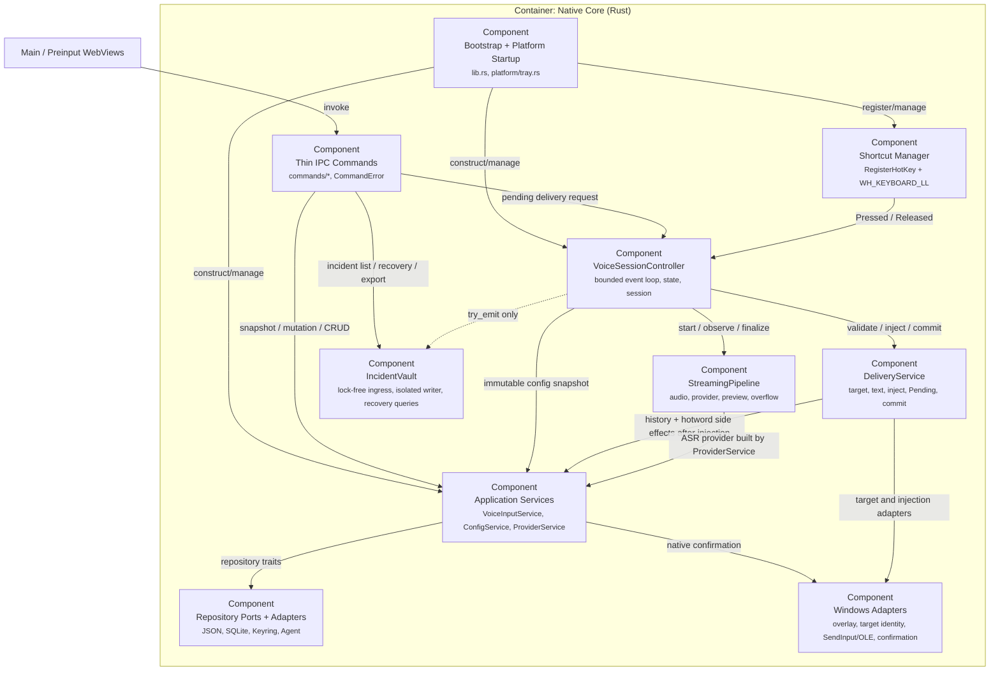

# C4 L3：Rust 后端组件

[component:backend.bootstrap] [component:backend.commands] [component:backend.services] [component:backend.voice-controller] [component:backend.streaming] [component:backend.delivery] [component:backend.shortcut] [component:backend.repositories] [component:backend.incident-vault]

## 组件责任

### Bootstrap + Commands

`lib.rs` 负责装配、Tauri managed state、handler 注册、窗口/托盘启动和退出清理。业务 command 位于 `commands/`，只处理窗口 label、DTO、服务调用和 `CommandError` 映射。

### AppServices

`ConfigService` 是配置的唯一服务层内存所有者，使用互斥 mutation 和 revision compare-and-swap。它通过 Repository/Credential 接口保存配置与秘密；写配置失败时恢复凭据快照。

`ProviderService` 在构建 ASR provider 时先检查 endpoint trust，再读取 CredentialStore。热词 Agent adapter 遵循相同顺序。

`VoiceInputService` 是语音输入启停和通用配置保存的应用层协调器。它按固定顺序协调配置 CAS、会话取消、运行状态、provider 重建、快捷键生命周期和状态事件；对应 command 只保留窗口权限校验、参数转发和错误 DTO 映射。

### VoiceSessionController

容量 16 的控制通道顺序处理 Pressed、Released、DeadlineReached、AudioOverflow、CancelRequested 和 ProviderFinished。通道不可用时失败关闭：取消当前会话并禁止注入。

`SessionCoordinator` 记录当前 session ID、取消令牌、Pending 队列和最新 metrics。异步完成路径必须验证仍拥有当前 session。

### ShortcutManager

`hotkey.rs` 单一拥有正式快捷键、设置预览和当前后端。标准模式先用备用 ID 完成 `RegisterHotKey` 并持续占有，提交时再提升为正式注册；独占模式由 `low_level_hook.rs` 的专用消息线程安装 `WH_KEYBOARD_LL`，只有完整组合的主键按下、重复和松开会被吞掉。修饰键与其他按键始终继续传播，回调只更新原子状态并 `try_send` 到有界队列。

独占模式允许第三方注入事件，只过滤带应用专用 `dwExtraInfo` 标记的自身 `SendInput`。它不覆盖安全桌面、驱动或更早吞键的钩子；语音输入显式关闭时正式快捷键会注销或失活并放行。

### StreamingPipeline

CPAL 录音以约 200ms chunk 写入容量 32 的有界队列。队列 Full 触发一次性 overflow 并取消，不静默丢帧；Closed 不误报 overflow。partial 通过 watch/latest-value 中继，final 通过 provider task 的 oneshot 结果返回。

### DeliveryService

交付顺序固定为：文本验证 → 目标身份/前台复验 → 注入 → 成功提交历史 → 触发热词整理。验证或注入失败进入最多 5 条、TTL 10 分钟的内存 Pending 队列。成功注入是不可回滚的提交点。

### Repository Ports + Adapters

`repositories.rs` 定义 ConfigRepository、CredentialStore、HistoryRepository、HotwordRepository 和 HotwordAgentClient。生产适配器继续复用原子 JSON、Windows Credential Manager 和同一个 SQLite 文件。

## IncidentVault

`IncidentSink` exposes only `try_emit`, health, and bounded shutdown; production initialization degrades to `NoopIncidentSink` on failure. The voice path pushes into capacity 64 control and capacity 64 audio `ArrayQueue` instances. Dropped audio uses an independent capacity 64 lock-free gap-marker queue, so completeness does not depend on spare control-queue capacity. `Bytes` and `Arc<str>` clones share PCM and attempt identity.

One OS thread owns the write-path `incident.db` SQLite WAL connection and artifact handles. It catches writer panic, drains accepted events during the 500ms bounded shutdown window, checkpoints PCM, and performs retention/capacity maintenance. User-initiated list/copy/play/export/delete commands open short-lived isolated connections; they never participate in capture, ASR, delivery, or formal-history decisions.

Consent is a persisted per-attempt snapshot with separate content, audio, and text authorization bits. Restart recovery indexes only audio-authorized `.pcm.part` files as `truncated`; orphan/unauthorized files are removed. Artifact paths are single-component, reads verify SHA-256, deletion failures keep indexes retryable, and all persisted diagnostic messages use the shared redactor.

The normal history repository and schema remain separate. Successful delivery discards recovery material after a formal-history commit or when history is disabled; a history write failure keeps recovery data. Query/export access is main-window-only, audio is binary IPC, and ZIP fields are allowlisted so choosing transcript text does not implicitly export target-app context.
