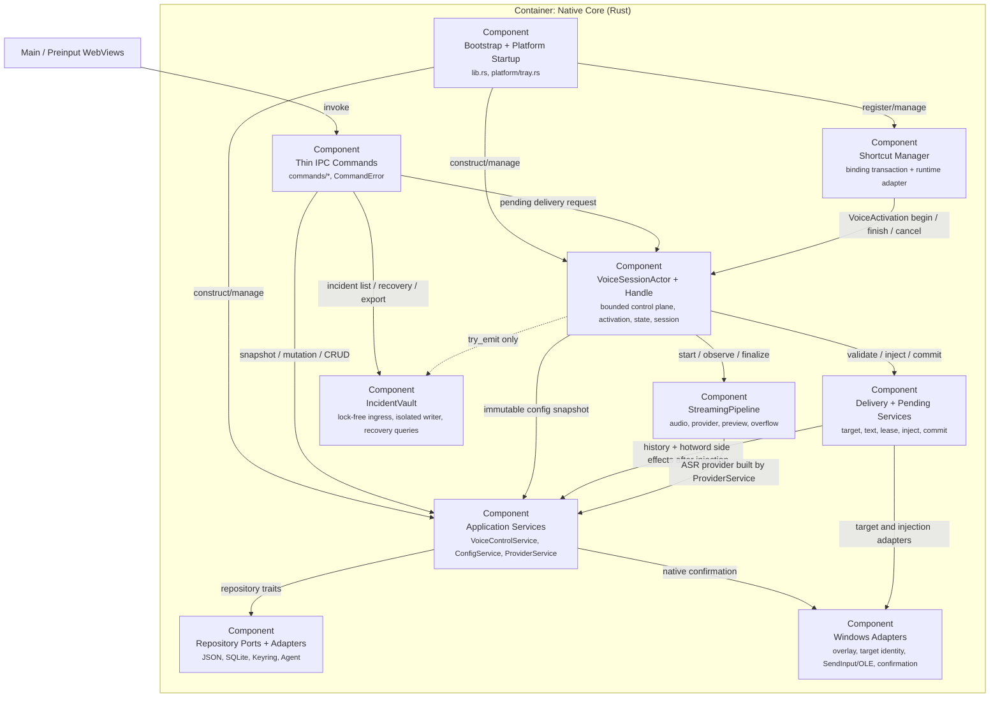

---
{"documentType":"c4-view","viewStatus":"current","sourceRevision":"38e54443bb4357771c9c789f83d5fc7e4ed3830c","worktreeState":"dirty","changedPaths":["src-tauri/src/voice_controller.rs","src-tauri/src/voice_input_service.rs","src-tauri/src/shortcut_manager","src-tauri/src/pending_output_service.rs"],"reviewStatus":"partial","reviewedAt":"2026-08-27","knownDeviations":["VoiceSessionActor 只串行化控制消息；release 后的 finalize task 仍通过 SharedRuntime 直接修改会话状态","VoiceControlService 在 Actor 与快捷键运行时确认应用前已经提交配置"]}
---

# C4 L3：Rust 后端组件

[component:backend.bootstrap] [component:backend.commands] [component:backend.services] [component:backend.voice-controller] [component:backend.streaming] [component:backend.delivery] [component:backend.shortcut] [component:backend.repositories] [component:backend.incident-vault]

## 组件责任

### Bootstrap + Commands

`lib.rs` 负责装配、Tauri managed state、handler 注册、窗口/托盘启动和退出清理。业务 command 位于 `commands/`，只处理窗口 label、DTO、服务调用和 `CommandError` 映射。

### AppServices

`ConfigService` 是配置的唯一服务层内存所有者，使用互斥 mutation 和 revision compare-and-swap。它通过 Repository/Credential 接口保存配置与秘密；写配置失败时恢复凭据快照。

`ProviderService` 在构建 ASR provider 时先检查 endpoint trust，再读取 CredentialStore。热词 Agent adapter 遵循相同顺序。

`VoiceControlService` 是语音输入启停和通用配置保存的应用层协调器。它当前先以 revision CAS 提交期望配置，再把 Actor 可用性命令入队并恢复快捷键运行时；后两步没有共同确认或补偿，因此失败时可能出现持久配置、Actor 和 Hook 的部分提交。对应 command 只保留窗口权限校验、参数转发和错误 DTO 映射。Provider 不再保存在共享运行时中，由 `ProviderService` 在 Actor 处理 begin 时按同一配置快照构造会话 Provider。

### VoiceSessionActor + VoiceSessionHandle

容量 16 的控制通道顺序处理带 `ActivationId` 的 Begin、Finish、Cancel、可用性和 Pending 交付命令；DeadlineReached、AudioOverflow 和 ProviderFinished 是独立内部事件。通道满时通过独立失败关闭信号取消当前会话。外部组件只持有 Handle 和 watch 状态快照，不能直接访问模块私有 Runtime。

但当前实现尚不是严格的 Actor 单写入者：`VoiceRuntime` 仍是模块内的 `Arc<Mutex<_>>`，release 后的 finalize task 持有其 clone，直接推进 Pasting、Pending、metrics、complete/error reset 和状态事件。Actor 串行化了控制入口，却没有串行化全部会话 mutation；取消只在 finalize 的若干等待点和注入前检查一次，尚不能证明取消与不可逆注入之间没有竞争窗口。`SessionCoordinator` 记录当前 session ID、取消令牌和最新 metrics；当前 Activation 由 Actor 命令路径设置，触发器的 finish/cancel 会先匹配当前 Activation。

### ShortcutManager

`ShortcutManager` 串行化快捷键 edit、启停、系统恢复和关闭，负责权威校验、配置事务、运行时绑定切换及失败回滚。有焦点的设置录入由前端 feature 负责；Manager 不生成逐键候选。

快捷键运行错误的权威副本位于 Manager 的协调状态；它还通过无确认的控制消息把错误投影到 Voice 状态快照用于 UI 展示。该投影不是语音输入可用性的权威，控制队列拥塞时可能暂时陈旧。

`WindowsKeyboardEngine` 只负责应用运行期间的全局物理快捷键监听。`ShortcutManager` 为一次按下创建 `ActivationId`，并通过 `VoiceTriggerPort` 配对 begin/finish；Hook 中断转换为同一 Activation 的 cancel。稳定职责边界见 [ADR-0010](adr/0010-separate-focused-shortcut-editing.md) 与 [ADR-0012](adr/0012-unified-voice-input-control-plane.md)。

Manager 事务、Windows Worker、generation 回执、失败回滚和诊断字段的完整说明见 [热键录入、换绑事务与 Windows 运行时链路](shortcut-editing.md)。

### StreamingPipeline

CPAL 录音以约 200ms chunk 写入容量 32 的有界队列。队列 Full 触发一次性 overflow 并取消，不静默丢帧；Closed 不误报 overflow。partial 通过 watch/latest-value 中继，final 通过 provider task 的 oneshot 结果返回。

### DeliveryService

交付顺序固定为：文本验证 → 目标身份/前台复验 → 注入 → 成功提交历史 → 触发热词整理。`PendingOutputService` 独占最多 5 条、TTL 10 分钟的内存队列，并用租约防止复制、丢弃和重新交付重复消费。Pending 重新交付由 Actor 与新会话开始串行化；成功注入仍是不可回滚的提交点。

### Repository Ports + Adapters

`repositories.rs` 定义 ConfigRepository、CredentialStore、HistoryRepository、HotwordRepository 和 HotwordAgentClient。生产适配器继续复用原子 JSON、Windows Credential Manager 和同一个 SQLite 文件。

## IncidentVault

`IncidentSink` exposes only `try_emit`, health, and bounded shutdown; production initialization degrades to `NoopIncidentSink` on failure. The voice path pushes into capacity 64 control and capacity 64 audio `ArrayQueue` instances. Dropped audio uses an independent capacity 64 lock-free gap-marker queue, so completeness does not depend on spare control-queue capacity. `Bytes` and `Arc<str>` clones share PCM and attempt identity.

One OS thread owns the write-path `incident.db` SQLite WAL connection and artifact handles. It catches writer panic, drains accepted events during the 500ms bounded shutdown window, checkpoints PCM, and performs retention/capacity maintenance. User-initiated list/copy/play/export/delete commands open short-lived isolated connections; they never participate in capture, ASR, delivery, or formal-history decisions.

Consent is a persisted per-attempt snapshot with separate content, audio, and text authorization bits. Restart recovery indexes only audio-authorized `.pcm.part` files as `truncated`; orphan/unauthorized files are removed. Artifact paths are single-component, reads verify SHA-256, deletion failures keep indexes retryable, and all persisted diagnostic messages use the shared redactor.

The normal history repository and schema remain separate. Successful delivery discards recovery material after a formal-history commit or when history is disabled; a history write failure keeps recovery data. Query/export access is main-window-only, audio is binary IPC, and ZIP fields are allowlisted so choosing transcript text does not implicitly export target-app context.
