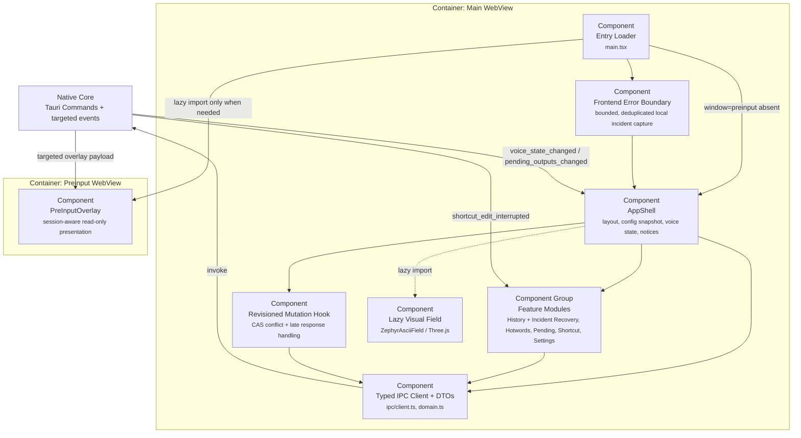

---
{"documentType":"c4-view","viewStatus":"current","sourceRevision":"38e54443bb4357771c9c789f83d5fc7e4ed3830c","worktreeState":"dirty","changedPaths":["docs/architecture/c4-components-frontend.md"],"reviewStatus":"stale","reviewedAt":"2026-08-27","knownDeviations":["源码快照早于当前 main；等待收口者基于合并后的 clean revision 完成语义复核"]}
---

# C4 L3：WebView 前端组件

[component:frontend.entry] [component:frontend.shell] [component:frontend.features] [component:frontend.presentation] [component:frontend.overlay] [component:frontend.ipc]

## 状态所有权

- `AppShell` 只共享当前配置、配置状态、语音状态、全局 notice 和 revision 协调。
- 每个 feature controller 自持表单、loading、notice、选择和编辑状态。
- Shortcut feature 在有焦点的设置字段内捕获编辑意图并维护局部录入反馈；后端负责提交结果和运行时绑定权威。具体候选、取消和提交时序见 [Current Runtime View](runtime-views.md#快捷键录入与提交)，稳定边界见 [ADR-0010](adr/0010-separate-focused-shortcut-editing.md)。
- `useRevisionedConfigMutation` 统一携带 expected revision，拒绝迟到响应，并在冲突时回载当前配置。
- `src/ipc/client.ts` 是组件调用 command 的唯一字符串入口；业务组件不散落 `invoke("...")`。
- `PreInputOverlay` 只按 session ID 与 seq 接受当前会话更新；它不会装载设置、历史或 Three.js bundle。

当前实现的详细状态机、DOM 事件规则和排障信息仅记录在[非规范性 Implementation Guide](shortcut-editing.md)；这些细节不定义组件长期责任。

## 异常恢复融合

History Dialog 在产品界面聚合正式历史与“需要处理”的异常记录，但通过独立 `incidentApi` 调用后端。恢复面可以查看阶段/原因/完整性，复制 final 或 partial，通过二进制 IPC 播放或导出 WAV，删除、保留和生成诊断 ZIP。Blob URL 在切换音频和组件卸载时统一撤销。

`FrontendErrorBoundary`、`window.error` 和 `unhandledrejection` 捕获只发送限长结构化异常；前端 10 秒去重、最多 64 个去重键，后端另有 2 秒全局限流。后端再次统一脱敏并以 `try_emit` 投递，失败不会反向改变 UI 或语音链路。

## 能力边界

主窗口与 preinput 使用独立 Tauri capability。后端仍对敏感 command 做窗口 label 复核，因此前端 capability 不是唯一授权边界。
