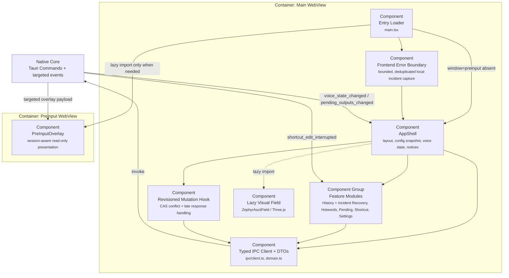

# C4 L3：WebView 前端组件

[component:frontend.entry] [component:frontend.shell] [component:frontend.features] [component:frontend.presentation] [component:frontend.overlay] [component:frontend.ipc]

## 状态所有权

- `AppShell` 只共享当前配置、配置状态、语音状态、全局 notice 和 revision 协调。
- 每个 feature controller 自持表单、loading、notice、选择和编辑状态。
- Shortcut feature 的 controller 在字段焦点内独占 DOM `KeyboardEvent.code`，维护 `idle/capturing/committing/warning/error`、本轮 `traceId/eventSeq`、左右修饰键和乐观标签。点击即进入录入并异步 begin；合法主键按下即乐观显示并 commit，失败按 outcome 回滚。后端只会用 `shortcut_edit_interrupted` 终止当前 edit，不发布候选或生命周期快照，也不存在轮询补偿。
- `useRevisionedConfigMutation` 统一携带 expected revision，拒绝迟到响应，并在冲突时回载当前配置。
- `src/ipc/client.ts` 是组件调用 command 的唯一字符串入口；业务组件不散落 `invoke("...")`。
- `PreInputOverlay` 只按 session ID 与 seq 接受当前会话更新；它不会装载设置、历史或 Three.js bundle。

## 异常恢复融合

History Dialog 在产品界面聚合正式历史与“需要处理”的异常记录，但通过独立 `incidentApi` 调用后端。恢复面可以查看阶段/原因/完整性，复制 final 或 partial，通过二进制 IPC 播放或导出 WAV，删除、保留和生成诊断 ZIP。Blob URL 在切换音频和组件卸载时统一撤销。

`FrontendErrorBoundary`、`window.error` 和 `unhandledrejection` 捕获只发送限长结构化异常；前端 10 秒去重、最多 64 个去重键，后端另有 2 秒全局限流。后端再次统一脱敏并以 `try_emit` 投递，失败不会反向改变 UI 或语音链路。

## 能力边界

主窗口与 preinput 使用独立 Tauri capability。后端仍对敏感 command 做窗口 label 复核，因此前端 capability 不是唯一授权边界。
