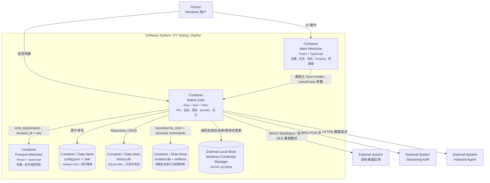

# C4 L2：容器

[component:frontend.ipc] [component:backend.bootstrap] [component:storage.local] [component:external.asr] [component:external.hotword-agent] [component:platform.windows]

这里的 Container 是 C4 的可独立理解运行单元，不等同于操作系统进程。主 WebView、preinput WebView 和 Rust 核心随同一个 Tauri 桌面包部署；数据存储由本机设施提供。

## 容器契约

| 容器 | 对外契约 | 不应承担 |
| --- | --- | --- |
| Main WebView | `src/ipc/client.ts` 中的类型化 commands；监听 voice/pending 事件 | 直接访问文件、数据库、Keyring 或远程服务 |
| Preinput WebView | 只读 overlay payload 与定向事件 | 配置、历史、凭据或外部请求 |
| Native Core | Tauri commands、全局热键、窗口/托盘、会话事件 | 暴露本地 HTTP 控制面 |
| config.json | schema version、revision、非秘密配置、信任和注入策略 | 保存 API key |
| history.db | 历史、热词、用户和应用上下文 | 保存原始音频 |
| incident.db + artifacts | 异常索引、授权后的短期音频/文本、内容无关指标 | 改变 ASR/注入/正式历史决策，或自动上传 |
| Credential Manager | 按凭据类型保存秘密 | 决定 endpoint 是否被授权 |

生产 CSP 禁止远程脚本、frame、object 和 base 重定向；开发 CSP 单独允许 Vite 本地服务。
