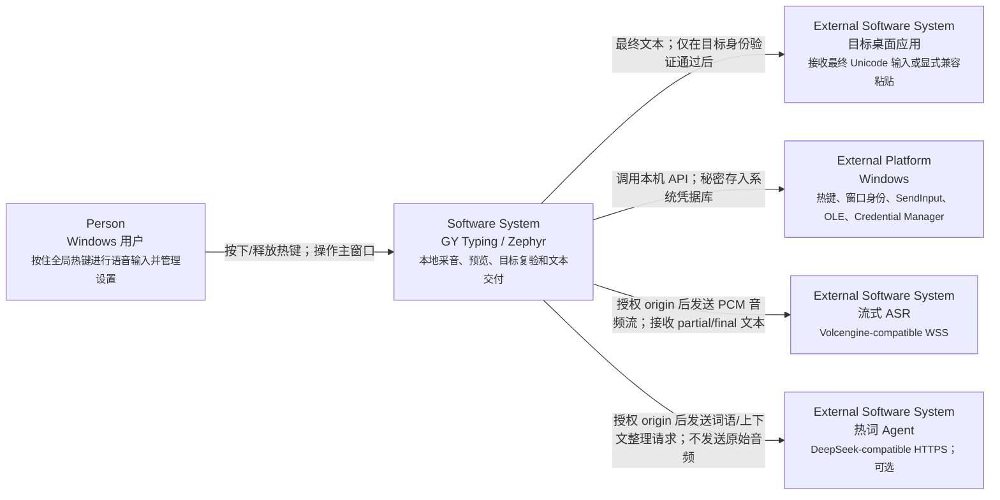

---
{"documentType":"c4-view","viewStatus":"current"}
---

# C4 L1：系统上下文

[component:system.zephyr] [component:external.asr] [component:external.hotword-agent] [component:platform.windows]

本图描述 GY Typing（界面品牌 Zephyr）的系统边界。它是用户 Windows 会话中的本地桌面应用，不提供本地 HTTP 控制面。

## 信任与数据边界

- **本机信任边界**：主 WebView 通过 Tauri IPC 调用 Rust；敏感 command 复核调用窗口 label。preinput WebView 只有悬浮展示所需能力。
- **目标应用边界**：自动交付前复验 HWND、PID、进程创建时间、可执行文件名和前台窗口；目标变化时不写入任何窗口。
- **ASR 边界**：音频只发往被授权的 ASR origin。官方 origin 默认信任，自定义 origin 首次携带凭据前必须经过 Rust 发起的 Windows 原生确认。
- **Agent 边界**：热词 Agent 是独立 purpose 的授权 origin；它不接收原始音频。
- **本地数据边界**：非秘密配置、历史/热词和凭据分别进入 JSON、SQLite 和 Windows Credential Manager。

## 范围外

当前边界不包含离线 ASR、模型下载、OTA、会议录音、屏幕上下文、云同步或本地 HTTP API。
