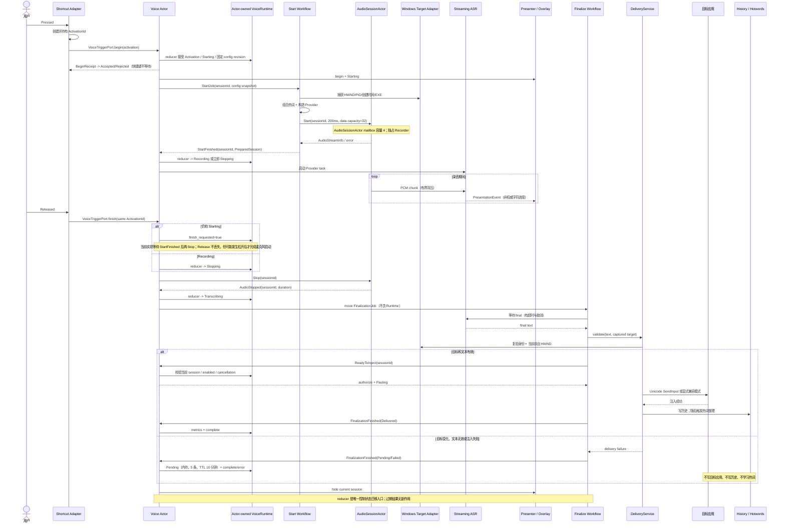
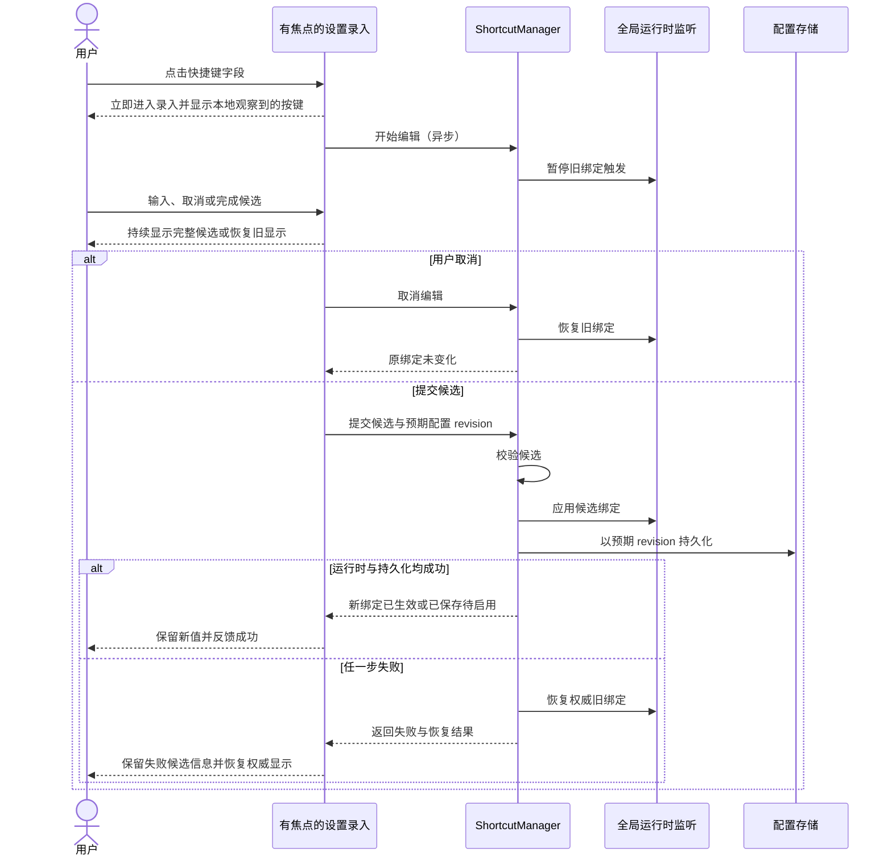
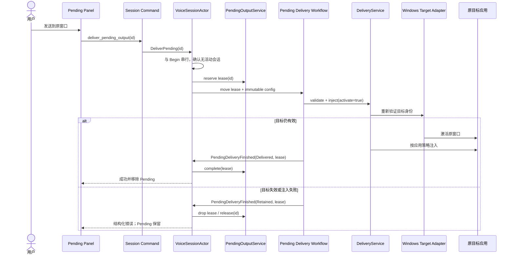
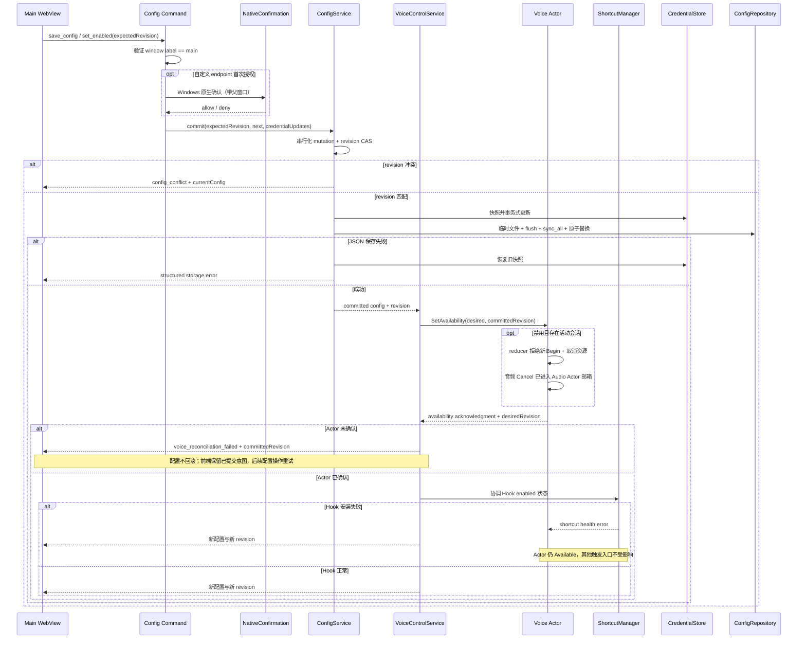
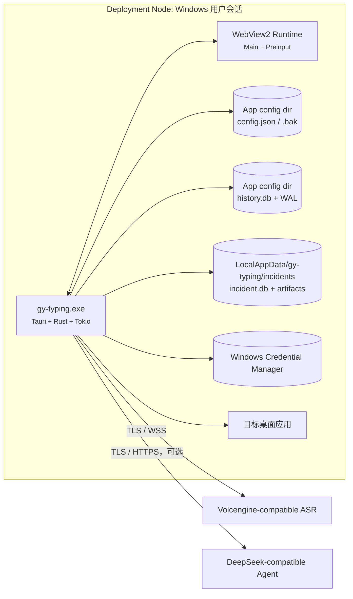
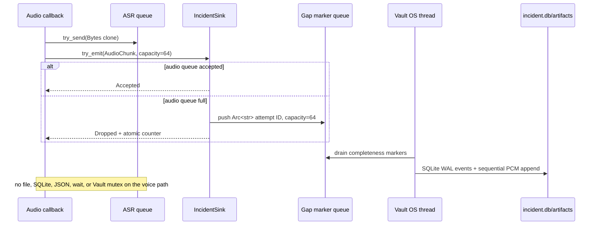

---
{"documentType":"runtime-view","viewStatus":"current","sourceRevision":"b62667deab18f740c83bab2f1bcebae2fd0a59e2","worktreeState":"dirty","changedPaths":["src-tauri/src/voice_controller","src-tauri/src/voice_trigger.rs","src-tauri/src/voice_input_service.rs","src-tauri/src/streaming_pipeline.rs","src-tauri/src/lib.rs","docs/architecture/runtime-views.md"],"reviewStatus":"partial","reviewedAt":"2026-08-28","knownDeviations":["Starting 阶段的匹配 Release 只记录 finish_requested，不取消尚未完成的音频启动；慢设备或快速按放时，Recorder 可能在用户松开后才完成启动并随后 Stop。"]}
---

# 运行时与部署视图

## 语音输入主链路

[component:backend.shortcut] [component:backend.voice-controller] [component:backend.streaming] [component:frontend.overlay] [component:backend.delivery]

该图描述当前实现。`VoiceRuntime` 只保存 desired state、availability、阶段、当前 Session/Activation、revision、取消状态和指标，不保存 Recorder、Injector、Provider task 或 SessionResources。Runtime 由 Voice Actor mailbox task 按值持有，纯 reducer 产生 Effects；start/finalize/pending 和 Streaming worker 均不能访问 Runtime。Presenter 是唯一 Tauri 状态事件与 Overlay 出口，流式字符数只是展示进度，权威 `VoiceStatusSnapshot` 只由 Actor 发布。

### 快捷键录入与提交

- View status: `current`
- Feature: [FEAT-SHORTCUT-BINDING](../features/shortcut-binding.md)
- Decisions: [ADR-0010](adr/0010-separate-focused-shortcut-editing.md), [ADR-0011](adr/0011-capability-aware-effective-validation.md)
- Validation: `partial`

设置录入负责即时反馈；后端负责校验、运行时应用、持久化和回滚；全局监听器只触发已提交绑定。具体 DOM 状态机、IPC 字段、Hook 恢复和日志排查见[非规范性 Implementation Guide](shortcut-editing.md)。

### 并发与终止条件

- 120 秒 deadline 和匹配当前 Activation 的真实 Released 进入相同的幂等 finalize 路径；迟到或其他 Activation 的 finish/cancel 被忽略。
- Starting 阶段的匹配 Release 只设置 `finish_requested`，不会取消 Start Workflow 或启动取消令牌；StartFinished 后才向 AudioSessionActor 发 Stop。这是当前实现事实，不是已验证的目标语义：慢设备或快速按放时可能在用户松开后才完成麦克风启动。
- 音频队列 Full、用户取消、provider 拒绝或控制通道失败都会取消当前会话并禁止交付。
- 旧 session 的 provider 完成只能记录，不能修改当前状态或产生文本副作用。
- provider final 最长等待路径由 preview 是否存在决定；取消令牌可提前终止等待。
- 每个已接受会话固定开始时的配置 revision、Provider 和注入策略快照；配置变更只影响后续会话。
- `desired_enabled`、Actor availability 与 shortcut health 是三个独立投影；Hook 错误不能把 Actor 改为 Disabled。
- 最后一个 Handle 释放后强 sender 消失，Worker 的 WeakSender 不维持 mailbox；应用退出另外显式 Shutdown Voice Actor，再由其 Shutdown Audio Actor。

## Pending 手动交付

“复制文本”是用户主动替换剪贴板，不自动恢复，也不自动写历史；“丢弃”只移除内存项。复制、丢弃和重新交付共享同一租约，不能重复消费同一 Pending。

## 配置与凭据事务

[component:backend.commands] [component:backend.services] [component:backend.repositories] [component:storage.local]

网络测试、录音和热词整理都必须在读取 Keyring 前重新确认 `scheme + host + effective port + purpose` 已授权。

## 部署视图

[component:system.zephyr] [component:platform.windows] [component:storage.local] [component:external.asr] [component:external.hotword-agent]

应用是 Windows-only 单机部署。开发时 Vite 运行在 localhost:1420；生产包只加载本地前端资源。

## 异常恢复旁路

[component:backend.incident-vault] [fact:incident.control-queue-capacity] [fact:incident.audio-queue-capacity] [fact:incident.audio-gap-queue-capacity]

partial checkpoint 最多每 500ms 一次；provider canonical final 在成功终止事件之前单独保存。Writer 在处理 `AttemptEnded` 前先排空 gap 与已接收音频，正常退出最多等待 500ms；writer panic 被自身线程捕获并只更新 health。

成功交付时，正式历史提交成功或历史被策略关闭都会删除恢复材料；正式历史写入失败则保留材料并记录 `history_write_failed`。失败材料默认 7 天，内容无关聚合默认 30 天。启动时未结束会话转为 `interrupted`：只有持久化音频子授权的 `.pcm.part` 会封存为 `truncated`，孤儿和未授权文件被删除。panic emergency 合法行导入后移除，坏行或失败行留待重试。

前端 History Dialog 通过独立 `incidentApi` 聚合恢复项。音频以二进制 IPC 转 WAV；Blob URL 在替换和卸载时撤销。诊断 ZIP 默认不含文本、音频或普通日志；勾选文本只加入 partial/final，不隐式加入 target app。普通日志选项当前截取最近日志尾部、上限 256KB，并统一脱敏。
