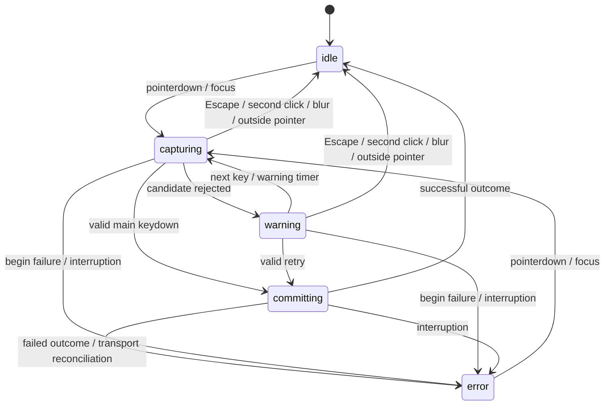
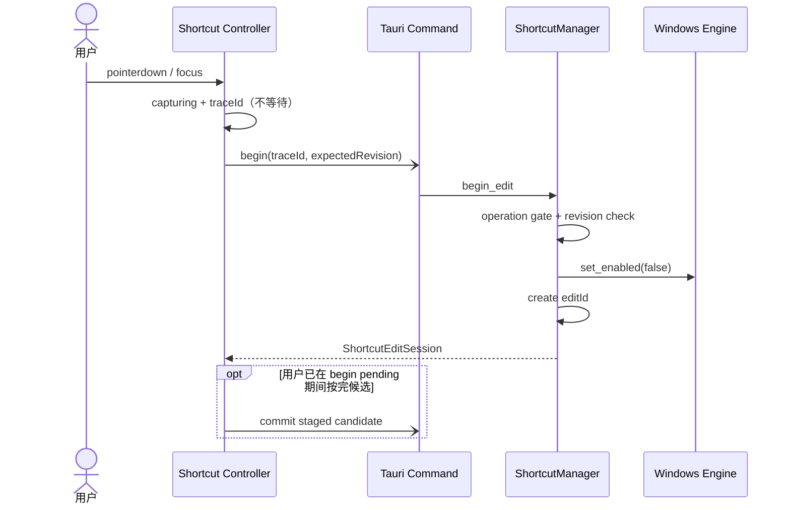
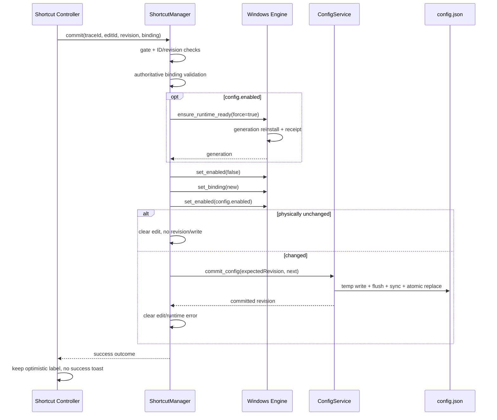
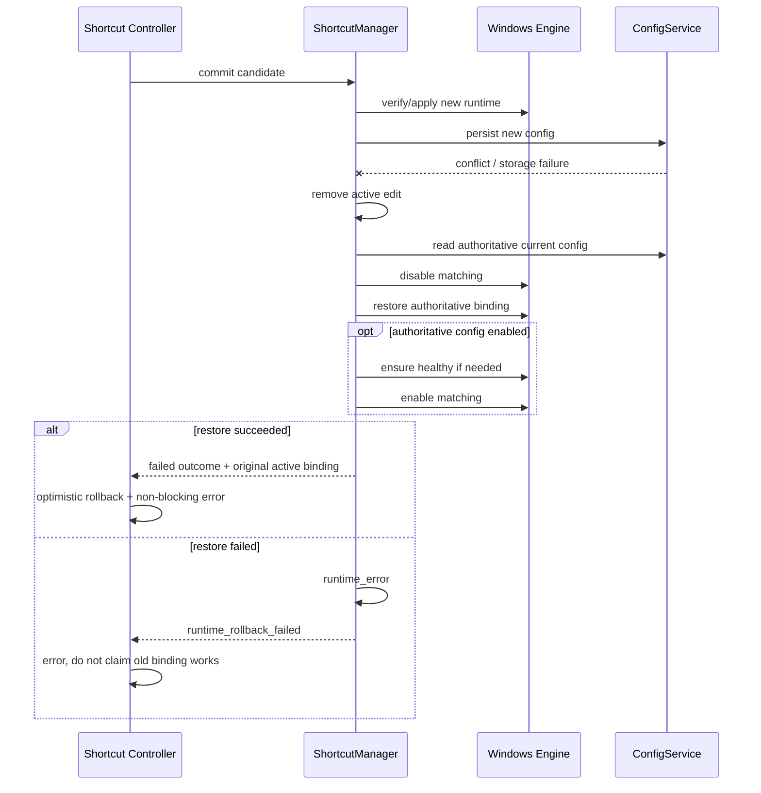

---
{
  "documentType": "implementation-guide",
  "normative": false,
  "viewStatus": "current",
  "relatedFeatures": ["FEAT-SHORTCUT-BINDING"],
  "sourceRevision": "dc4be390846b0a54e00cadf868db4b9c6db9686b",
  "worktreeState": "dirty",
  "changedPaths": ["docs/architecture/shortcut-editing.md", "docs/features/shortcut-binding.md", "src/features/shortcut", "src-tauri/src/shortcut_manager", "src-tauri/src/windows_keyboard.rs"],
  "reviewStatus": "partial",
  "reviewedAt": "2026-08-27"
}
---

# 热键录入、换绑事务与 Windows 运行时链路

[component:frontend.features] [component:frontend.ipc] [component:backend.commands] [component:backend.shortcut] [component:backend.services] [component:backend.voice-controller] [component:storage.local] [component:platform.windows]

本文是非规范性的当前实现指南与排障手册，描述设置界面录入、Tauri IPC、`ShortcutManager` 事务、`WH_KEYBOARD_LL` 运行时匹配、配置持久化、失败回滚和诊断日志。源码仍是实现事实；产品行为以 Feature Dossier 为准，长期边界以 ADR 为准，关键跨边界时序以 Current Runtime View 为准。

当前实现核对日期：2026-08-27。

## 1. 设计结论

热键功能分为两条职责严格分离的链路：

1. **编辑链路**：设置窗口获得焦点后，在本地输入边界形成候选并立即反馈；当前实现使用 DOM `KeyboardEvent.code` 完成左右修饰键识别、实时键帽、候选校验和乐观显示。
2. **运行时链路**：Rust `WH_KEYBOARD_LL` 只负责应用运行期间的全局物理热键匹配，以及向 `VoiceSessionController` 发送 `Pressed` / `Released`。

当前实现及其稳定结果边界如下；DOM、具体 IPC 和 Hook generation 属于可替换的实现事实，不是永久技术约束：

- Hook 不生成换绑候选，不维护 `captureId`，不向前端发送按键进度。
- 前端不通过 Hook Event 或生命周期轮询获得键帽。
- 点击字段后的视觉录入不等待 begin IPC、Hook generation 或磁盘。
- begin 只暂停旧运行时匹配；Hook generation 确认只发生在 commit、启用、resume 或已知不健康恢复路径。
- 成功提交不显示成功弹窗；失败必须恢复权威配置，并且只有恢复成功时才能说明旧快捷键仍可用。
- 配置 schema、`ShortcutBinding` 序列化和物理扫描码模型保持稳定。

明确不在当前范围内：

- 一个动作绑定多个热键。
- 设置页之外的 DOM 全局键盘监听。
- 单独的“保存快捷键”按钮。
- 用 `RegisterHotKey` 或 Tauri `globalShortcut` 替换低级 Hook。
- 把语音录制生命周期与换绑 edit 生命周期合并。

## 2. 代码入口与所有权

| 层 | 主要文件 | 当前责任 |
| --- | --- | --- |
| 输入字段 | `src/features/shortcut/ShortcutCaptureField.tsx` | 焦点、点击、外部点击、键盘事件转发、状态样式和无障碍属性 |
| 前端控制器 | `src/features/shortcut/useShortcutBindingController.ts` | edit 状态、trace、左右修饰键、候选暂存、乐观更新、取消和回滚 |
| 物理键映射 | `src/features/shortcut/shortcutCapture.ts` | `KeyboardEvent.code` 到 Windows set-1 扫描码的集中映射，以及前端同步校验 |
| 前端契约 | `src/domain.ts` | `ShortcutBinding`、edit session/outcome、错误码和 trace DTO |
| IPC client | `src/ipc/client.ts` | begin/commit/cancel/trace 四个唯一 command 字符串入口 |
| Tauri commands | `src-tauri/src/commands/shortcut.rs` | 主窗口权限校验、阻塞任务边界和错误 DTO 映射 |
| 事务协调 | `src-tauri/src/shortcut_manager/` | `mod.rs` 组装 Tauri façade；`coordinator.rs` 保留 begin/cancel 与依赖组装；`state.rs` 管理 edit 状态；`commit.rs` 编排提交；`recovery.rs` 负责权威恢复；`runtime_lifecycle.rs` 处理启停、中断与恢复；其余文件承载契约、校验、端口和诊断 |
| 物理模型 | `src-tauri/src/physical_shortcut.rs` | 扫描码、extended、左右修饰键、编译、显示标签和运行时匹配语义 |
| Windows 引擎 | `src-tauri/src/windows_keyboard.rs` | Hook/dispatch Worker、generation 恢复、全局 Pressed/Released 和运行时诊断 |
| 配置事务 | `src-tauri/src/services.rs`, `src-tauri/src/config.rs` | revision CAS、原子 JSON 写入、备份和内存权威快照 |
| 启停与恢复 | `src-tauri/src/voice_input_service.rs`, `src-tauri/src/platform/tray.rs`, `src-tauri/src/lib.rs` | 配置启停、托盘启停、resume、shutdown 和日志注册 |

前端组件不能直接散落新的 `invoke("...")`；所有 IPC 必须经 `src/ipc/client.ts`。后端 command 不能直接操作 Hook 原子状态；必须经 `ShortcutManager`。

## 3. 稳定数据模型

### 3.1 `ShortcutBinding`

配置保存物理绑定，而不是依赖当前键盘布局的字符：

```json
{
  "modifiers": [
    { "kind": "control", "side": "left" },
    { "kind": "shift", "side": "right" }
  ],
  "trigger": {
    "scanCode": 37,
    "extended": false
  }
}
```

- `scanCode` 是 Windows set-1 物理扫描码。
- `extended` 区分右 Ctrl、右 Alt、方向键、导航键、右 Win 等扩展键。
- modifier `kind` 为 `control | alt | shift | win`。
- modifier `side` 为 `any | left | right`；DOM 新录入只生成精确左右侧，`any` 用于兼容旧配置。
- `trigger` 可以是普通主键，也可以是修饰键。修饰键作为 trigger 时表示纯修饰键或修饰键组合。

后端 `ShortcutBinding::compile()` 将绑定压缩为 `trigger`、`sided_modifiers`、`any_modifiers` 和 `trigger_modifier`。运行时匹配要求每一类修饰键与配置一致：精确左侧不会匹配右侧；`any` 要求该类恰好有一侧按下；额外未配置修饰键会使匹配失败。

### 3.2 Edit session

`begin_shortcut_edit` 返回：

```text
editId
traceId
configRevision
activeLabel
activeBinding
runtimeState
errorCode?
message
```

`editId > 0` 且没有 `errorCode` 才表示后端 edit 已建立。`activeLabel` / `activeBinding` 始终描述权威配置，不是前端候选。

### 3.3 Edit outcome

commit 和 cancel 返回：

```text
success
editId
traceId
configRevision
activeLabel
activeBinding
runtimeState
changed
errorCode?
message
```

前端必须用 outcome 的 revision、label 和 binding 对账。业务失败仍返回 outcome；只有 command 传输、任务执行或内部锁损坏才走 IPC error。

### 3.4 稳定错误码

| 错误码 | 含义 | 配置是否改变 | 旧运行时是否保证恢复 |
| --- | --- | --- | --- |
| `invalid_binding` | 物理绑定格式或组合不合法 | 否 | 回滚成功时是 |
| `reserved_binding` | Windows 保留组合 | 否 | 回滚成功时是 |
| `revision_conflict` | edit revision 或当前配置 revision 不匹配 | 否 | 回滚成功时是 |
| `hook_unavailable` | Hook/dispatch/generation/运行时应用不可用 | 否 | 仅回滚成功时是 |
| `persistence_failed` | 新运行时已应用，但配置原子持久化失败 | 否 | 仅回滚成功时是 |
| `hook_interrupted` | edit 已结束、被启停/resume/Worker 中断，或关联 ID 失效 | 否 | 视 outcome runtimeState 而定 |
| `runtime_rollback_failed` | 失败后无法恢复权威旧运行时 | 否 | 否 |
| `capture_timeout` / `release_timeout` | 兼容旧 DTO | 新链路不产生 | 不适用 |

## 4. 用户可见时间线

| 时刻 | 用户看到的 | 当前代码正在发生的 |
| --- | --- | --- |
| ① 初始 | 当前键帽和“点击更改” | `AppConfig.shortcut` 是权威显示值 |
| ② 点击/聚焦 | 当帧进入蓝色录入状态，旧键帽隐藏 | 前端生成 `traceId`、进入 `capturing`、异步调用 begin |
| ③ 后台 begin | 录入界面不等待 | Manager 校验 revision，并将 Hook matching 设为 disabled |
| ④ 按修饰键 | 左/右修饰键逐键即时显示 | DOM `keydown` 更新 `heldModifiers` / `seenModifiers` |
| ⑤ 按主键 | 合法候选立即显示，字段退出录入外观 | 前端同步校验并进入 `committing` |
| ⑥ 后台提交 | 新值乐观保持，字段短暂不可操作 | commit 核对 edit、后端校验、确认 Hook、切换运行时 |
| ⑦ 持久化 | 无成功动画或成功弹窗 | ConfigService 用 expected revision 原子写入新配置 |
| ⑧ 成功 | 新键保持并立即可用 | Manager 清除 edit，outcome 返回新 revision |
| ⑨ 失败 | 错误浮层和字段错误，键帽恢复旧值 | Manager 恢复权威旧 binding/enabled；前端应用失败 outcome |
| ⑩ 取消 | 字段恢复旧键帽 | cancel 清除 edit并恢复权威旧运行时 |

正常目标延迟不是协议保证，而是实现目标：

- 点击到录入外观：0–16ms。
- 修饰键到键帽：0–16ms。
- 普通组合完成：主键 `keydown` 当帧。
- 纯修饰键：固定至少 200ms。
- 点击到旧匹配暂停：通常 1–10ms，异步且不阻塞 UI。
- 健康 Hook generation：通常 1–20ms，故障等待上限 2 秒。
- 配置写盘：通常 5–80ms，取决于磁盘。

## 5. 前端录入状态机



### 5.1 点击与焦点

`ShortcutCaptureField` 在 pointerdown/focus 时调用 `beginShortcutEdit()`，然后在下一帧聚焦按钮。`beginShortcutEdit()` 同步完成以下本地操作：

1. 增加前端 generation。
2. 生成 `crypto.randomUUID()` traceId。
3. 清空本轮 held/seen/pending/commit 状态。
4. 清空显示标签并进入 `capturing`。
5. 记录 `ui_capture_started`。
6. 异步发送 begin IPC。

begin 未返回时，DOM 仍继续录入。合法候选进入 `pendingCandidateRef`；begin 成功取得 `editId` 后自动调用 commit。begin 失败时应用 session 中的权威旧配置并进入 `error`。

### 5.2 DOM 键盘规则

- 仅字段处于 `capturing` 或 `warning` 时处理事件。
- 所有被处理事件执行 `preventDefault()` 和 `stopPropagation()`。
- `repeat=true` 只记日志，不改变候选。
- 裸 Escape 取消；带修饰键 Escape 作为普通候选进入校验。
- DOM `code` 决定物理键；`key` 只进入诊断日志，不决定扫描码。
- 修饰键顺序固定为 Ctrl、Alt、Shift、Win，同类左侧在右侧之前。
- 普通主键 `keydown` 立即生成候选，不等待 keyup。
- 纯修饰键记录首次按下时间，全部释放且持有至少 200ms 后生成候选。
- `getModifierState("AltGraph")` / `AltRight` 路径会移除浏览器合成的 `ControlLeft`，避免 AltGr 被错误显示为左 Ctrl + 右 Alt。

### 5.3 前端同步校验

允许单独使用：

- Space、Tab、Backspace。
- Insert/Delete、Home/End、PageUp/PageDown、方向键。
- PrintScreen、Pause、ScrollLock、NumLock。
- F1–F11、F13–F24。

字母、数字、标点、Enter、数字小键盘键必须带修饰键。最多三个物理键。

前端拒绝：

- F12。
- Ctrl+Alt+Delete。
- Ctrl+Shift+Escape。
- Alt+Tab。
- Alt+F4。
- Win+L。
- 无修饰键的普通字符。
- 单独左 Ctrl/Alt/Shift/Win 或单独右 Win。

前端校验只用于即时反馈；后端必须重新执行等价权威校验。

### 5.4 乐观显示与迟到响应

合法候选先写入 `displayLabel`，再发送 commit。成功 outcome 静默更新 config；失败 outcome 恢复其 `activeLabel` / `activeBinding` 并显示错误。

前端以本地 generation、traceId 和 editId 拒绝迟到响应：

- 旧 begin 回执若带有效 editId，会发送补充 cancel。
- 旧 commit 回执不允许覆盖新一轮 edit。
- `shortcut_edit_interrupted` 必须匹配当前 traceId；已知 editId 时还必须匹配 editId。

## 6. IPC 边界

```text
begin_shortcut_edit(traceId, expectedRevision)
commit_shortcut_edit(traceId, editId, expectedRevision, binding)
cancel_shortcut_edit(traceId, editId)
record_shortcut_edit_trace(input)
```

四个 command 都复核调用窗口 label 必须为 `main`。begin/commit/cancel 通过 `spawn_blocking` 调用同步 Manager，避免 Hook generation、配置写入或 operation gate 阻塞 Tauri async executor。trace 是限长同步 command；前端 fire-and-forget，日志失败不能影响录入 UI。

`editId=0` 是后端支持的特殊取消形式：当 begin 回执可能丢失时，Manager 可按 traceId 取消该 edit。

## 7. Manager 事务与不变量

`ShortcutManager` 只允许一个 `ShortcutEditTransaction`：

```text
editId
traceId
expectedRevision
startedAt
```

`operation_gate` 串行化 Manager 内部的 begin、commit、cancel、enable、resume、Hook interruption 和 shutdown。代码必须保持以下锁顺序：

```text
operation gate
→ 短暂读取 Manager state / Config snapshot
→ Engine 或 Config 操作
→ 短暂提交 Manager state
```

不得持有 Manager state 锁等待 Hook generation、磁盘、Tauri Event 或 voice controller。Engine handle 以 `Arc` 短暂克隆，不能同时长期持有 Manager state 与 Engine slot 锁。

### 7.1 Begin



begin 行为：

- 验证 traceId 和 expected revision。
- 相同 trace/revision 的重复 begin 返回现有 session。
- 不同的新 begin 会中断旧 edit并恢复权威运行时。
- Engine slot 缺失时返回 `hook_unavailable` session，并设置 runtime error。
- 成功时只执行 `engine.set_enabled(false)`，不等待 Hook generation。

### 7.2 Commit 成功



成功 commit 的准确含义是：Hook generation 健康、物理绑定可以编译并已写入运行时、配置持久化成功。由于本项目使用低级 Hook，而不是 `RegisterHotKey`，成功不表示 Windows 为该组合提供了独占注册回执。

### 7.3 Commit 失败与回滚



任何已知失败都先从 Manager state 清除当前 edit，再按 `ConfigService::snapshot()` 恢复运行时。配置只有在成功持久化后改变；新运行时已应用但持久化失败时必须恢复旧运行时。

### 7.4 Cancel

cancel 核对 traceId，`editId != 0` 时同时核对 editId。成功取消先从 Manager state 取走 edit，再恢复当前权威 binding 和 enabled。恢复失败返回 `runtime_rollback_failed`。

前端裸 Escape、再次点击、blur、外部 pointer、关闭设置抽屉和组件卸载都会尝试取消。`committing` 阶段 UI 锁定，不接受普通取消；外部 enable/resume/Hook interruption 仍可通过后端 interruption 终止。

### 7.5 外部中断

以下路径会中断活动 edit：

- enabled 配置变化。
- 托盘启停。
- Tauri `RunEvent::Resumed`。
- 确认的 Hook Worker 退出。
- 新 begin 取代旧 begin。
- shutdown。

Manager 尝试恢复权威运行时，并只向前端发布一个 `shortcut_edit_interrupted`。事件 payload 是标准 `ShortcutEditOutcome`；前端按 traceId/editId 拒绝陈旧事件。

## 8. Windows Hook 运行时

### 8.1 Worker 模型

```text
Hook Worker
  WH_KEYBOARD_LL callback
  Windows message loop
  install/reinstall/uninstall Hook

        try_send, capacity 32
                 ↓

Dispatch Worker
  Pressed/Released 去重
  desired_active 对账
  callback panic 隔离
  调用 ShortcutManager.handle_engine_event
                 ↓

VoiceSessionController
  SessionEvent::Pressed / Released
```

Hook 回调只允许：

- 读取 `KBDLLHOOKSTRUCT`。
- 更新 atomics。
- 编译后绑定的无锁匹配。
- `SyncSender::try_send`。
- 必要时返回 `LRESULT(1)` 吞掉运行时触发键。

禁止：

- 等待 Mutex/Condvar。
- 磁盘、数据库或配置访问。
- Tauri Event 或 UI 调用。
- 直接逐键日志。
- 候选录入状态。

### 8.2 Pressed / Released

普通主键绑定：

- modifier 事件持续更新左右 held bits。
- trigger keydown 且 modifiers 精确匹配时设置 `active_down` / `desired_active` 并发送 Pressed。
- trigger keyup 发送 Released。
- trigger down/up 在匹配期间被 Hook 吞掉。

纯修饰键绑定：

- modifier down 后，如果整个修饰键组合精确匹配，则发送 Pressed。
- 任一必需修饰键释放后发送 Released。
- Win 修饰键在绑定包含它时被吞掉，避免 Windows 自身行为打断组合；普通 Ctrl/Alt/Shift modifier 仍向系统传播。

`SELF_INJECTED_MARKER` 标记本应用注入的键盘输入，Hook 必须忽略，防止输出文本或兼容输入反向触发语音快捷键。

AltGr 运行时修正依赖 Windows 低级事件时间：右 Alt 按下前 2ms 内出现的左 Ctrl 被视为合成 Ctrl，从 held bits 移除。

### 8.3 有界队列与状态对账

信号通道容量固定为 32。成功入队增加 `emitted`，队列满或断开增加 `dropped`。`desired_active` 是 Pressed/Released 的最终期望状态；dispatch 每处理一个信号后，将已交付状态与 desired 对账，补偿单次 Pressed 或 Released 丢失。

真正的 dispatch 退出不重建固定 Receiver。之后 `ensure_runtime_ready` 返回 dispatch unavailable，Manager 进入明确 runtime error，需要重启应用。

### 8.4 Hook generation 与恢复

generation 重装流程：

1. 确认 dispatch 存活。
2. 回收已结束的 Hook Worker。
3. 必要时创建新 Hook Worker和消息循环。
4. 生成递增 generation。
5. 通过 `PostThreadMessageW` 把 generation 放入 `WPARAM`。
6. Hook Worker 卸载旧 Hook、重新安装，并将相同 generation 的成功/错误写入 `Mutex<HookInstallReceipt>`。
7. 调用线程用 Condvar 最多等待 2 秒。

初次 Hook 安装失败不会销毁 Worker；消息循环继续运行，engine 保持 degraded，下一次 commit/enable/resume 可以重新安装。Worker 创建失败时 slot 保持为空，下一次恢复入口可以再次创建。

Worker 异常退出时设置 unhealthy、清空 thread ID，并通过有界 signal 通知 Manager。若通知稍晚但 Worker 已被另一恢复入口重建并恢复健康，Manager 会忽略陈旧 interruption。

强制 generation 确认发生在：

- enabled 配置下提交候选，包括未变化候选。
- disabled → enabled。
- 系统 resume。

普通 cancel/rollback 只在缓存健康异常时重装，不无条件增加延迟。

### 8.5 Hook 链与冲突应用

Windows 为每种 Hook 类型维护独立链。`SetWindowsHookEx` 将新 Hook 放到链首；链上的 Hook 可以调用 `CallNextHookEx` 继续传递，也可以返回非零阻止后续 Hook 和目标窗口收到事件。因此 `WH_KEYBOARD_LL` 没有类似 `RegisterHotKey` 的永久所有权或冲突回执，Hook generation 只证明本应用本轮安装成功，不证明 Zephyr 在其他 Hook 之前，也不证明其他应用会继续传递事件。

当前 Zephyr 的普通主键绑定在完整匹配时吞掉 trigger down/up；纯 Ctrl/Alt/Shift modifier 绑定触发 `Pressed` 后仍调用下一 Hook，只有绑定中包含的 Win modifier 会被吞掉。由此可推导：链首位置、各应用是否吞键和具体绑定类型共同决定“都触发、只触发一个或系统也收到”的结果。

2026-08-26 的目标环境观察暂记为待验证：Z 与 T 同绑 `RightAlt`，`T → Z` 启动时两者都触发，`Z → T` 启动时只有 T 触发，退出 T 后 Z 恢复触发。它与 `Z → T` 时 T 位于链首并阻断后续传播、`T → Z` 时 Z 位于链首但继续传递 `RightAlt` 的模型一致；这仍是基于 Windows 规范和 Zephyr 源码的推断，不等同于已经证明 Typeless 使用了哪一种内部 API。验证项见 Dossier `AC-SC-08`。

规范依据：

- [Microsoft Hooks Overview](https://learn.microsoft.com/en-us/windows/win32/winmsg/about-hooks)
- [Microsoft LowLevelKeyboardProc](https://learn.microsoft.com/en-us/windows/win32/winmsg/lowlevelkeyboardproc)
- [Microsoft CallNextHookEx](https://learn.microsoft.com/en-us/windows/win32/api/winuser/nf-winuser-callnexthookex)

## 9. 配置持久化与权威状态

`ConfigService` 是配置 revision 的唯一进程内权威：

1. `mutation` Mutex 串行化配置写入。
2. snapshot revision 必须等于 expected revision。
3. repository 先写磁盘。
4. 写入成功后才更新内存 snapshot。

Windows JSON 写入顺序：

```text
create_new sibling temp
→ write_all
→ flush
→ sync_all
→ MoveFileExW(REPLACE_EXISTING | WRITE_THROUGH)
→ update in-memory snapshot
```

写新配置前会保留上一份可解析配置为 `.bak`。换绑只修改：

- `shortcut`
- `shortcut_binding`
- `schema_version`
- `revision`

不会修改 enabled、ASR、历史、热词、凭据或其他配置字段。

## 10. 结构化日志与排障

### 10.1 日志设置

- target：`shortcut_edit_trace`
- target level：Debug
- 默认其他模块：Info
- 单文件：2,000,000 bytes
- 轮转：保留 5 个文件
- 输出：stdout 与 Tauri 应用日志目录

原始按键日志只在设置页 edit 期间由主窗口上报。它记录按键，不记录语音内容。

### 10.2 正常成功序列

一次正常换绑应能按同一 traceId 看到：

```text
frontend_trace phase=ui_capture_started
edit_begin_requested
runtime_suspended
edit_begin_completed
frontend_trace phase=dom_keydown ...
frontend_trace phase=candidate_finalized
frontend_trace phase=begin_acknowledged
frontend_trace phase=commit_dispatched
commit_requested
validation_completed
hook_reinstall_requested
hook_reinstall_completed
runtime_binding_applied
persistence_started
persistence_completed
commit_completed
frontend_trace phase=commit_completed
```

begin 和 DOM 按键并发，因此 `begin_acknowledged` 可以在 `candidate_finalized` 前后出现。只要 traceId 相同且 candidate 最终提交，该顺序差异是正常的。

之后按下新运行时热键应看到：

```text
runtime_binding_pressed
runtime_binding_released
```

这两个 runtime 事件目前使用 `traceId=none`，通过时间和 hookGeneration 与最近一次提交关联。

### 10.3 关键字段

| 字段 | 含义 |
| --- | --- |
| `traceId` | 一次前端录入尝试的全链路关联 ID |
| `editId` | 后端 edit session ID；begin 前为 none |
| `eventSeq` | 当前 trace 内前端单调事件序号 |
| `clientElapsedMs` | 从点击录入开始的前端时间 |
| `expectedRevision/currentRevision` | edit 所持版本与当前权威配置版本 |
| `hookGeneration` | 最近明确安装回执对应的 Hook generation |
| `observed/emitted/dropped` | Hook 进程累计原始事件、成功信号、丢弃信号 |
| `hookHealthy` | 最近安装结果是否健康 |
| `hookWorkerAlive/dispatchAlive` | 两个 Worker 当前存活状态 |
| `candidateBinding` | 前端生成的物理绑定 |
| `rollbackResult` | none/pending/success/failed |

### 10.4 从症状定位层级

| 症状 | 首先查找 | 可能层级 |
| --- | --- | --- |
| 点击后没有录入样式 | `ui_capture_started` | 字段 pointer/focus 或前端 controller |
| 有录入样式但按键无日志 | `dom_keydown` | WebView 焦点、DOM 事件或旧 Hook 极短暂停窗口 |
| modifier 有日志但键帽不对 | `heldCodes`, `AltGraph`, `candidateLabel` | 前端 modifier/AltGr 组装 |
| 候选已显示但没有提交 | `candidate_finalized`, `begin_acknowledged` | begin IPC/session 关联 |
| commit 停在 Hook | `hook_reinstall_*` | Hook Worker、generation、dispatch |
| runtime applied 后失败 | `persistence_*` | revision conflict 或磁盘持久化 |
| 失败后旧键不可用 | `rollback_*`, `runtimeState` | 权威运行时恢复失败 |
| 配置成功但新键不触发 | `runtime_binding_pressed` | 物理匹配、左右侧、其他低级 Hook 或运行时 enabled |
| 应用 resume 后失效 | `hook_reinstall_*`, `hook_interrupted` | resume 恢复路径 |

复现日志应至少保留：点击前的最近一次 Hook install/reinstall、完整 traceId、commit 终态，以及随后新旧快捷键各一次 Pressed/Released 尝试。

## 11. 当前已知限制与未闭环风险

本节记录的是当前真实代码的限制，不是已经实现的产品契约。后续修改应优先逐项关闭这些边界，而不是再引入一套捕获状态机。

### 11.1 Begin pending 时的快速取消

前端在点击字段后立即进入本地录入，`begin_shortcut_edit` 尚未返回时 `editId` 仍为空。此时若用户立即 Escape、再次点击或点到字段外，前端会退出本地录入，但不会发送 `cancel_shortcut_edit(traceId, 0)`。如果 begin 随后成功，前端会在迟到回执处理里尝试取消；因此最终可恢复，但存在短暂的后端 edit session 和运行时暂停窗口。

### 11.2 传输失败后的对账顺序

commit 出现 IPC 传输失败时，前端当前会 fire-and-forget 发送 cancel，随后立即读取配置对账。cancel 与读取没有严格的 happens-before 保证，极端情况下 UI 可能先读到旧 revision 或暂态 runtimeState。后端业务失败通过 `ShortcutEditOutcome` 返回时没有这个问题。

### 11.3 没有服务端 edit lease

后端 edit session 没有租约或孤儿超时。如果渲染进程在 begin 成功后崩溃、主窗口异常销毁，且没有触发 interruption/cancel，旧快捷键可能持续保持暂停，直到 enable、resume、配置变更、shutdown 或下一次受门闩保护的恢复路径介入。

### 11.4 AltGr 与真实左 Ctrl + 右 Alt

前端使用 `getModifierState("AltGraph")` 和 `AltRight` 消除 Windows AltGr 合成出来的伪 `ControlLeft`。这能避免多数国际键盘误录，但真实意图为 `ControlLeft + AltRight + 主键` 的组合也可能被归一化为 AltGr 场景。若产品需要允许该组合，必须结合原始事件序列重新定义规则。

### 11.5 旧快捷键暂停不是零延迟

录入外观和 DOM 捕获是同步开始的，后端暂停旧快捷键通过异步 IPC 完成。因此从 pointerdown 到 `set_enabled(false)` 生效之间存在通常为毫秒级的小窗口。UI 不应为消除这个窗口而重新等待 Hook 握手，否则会退回此前的不稳定交互模型。

### 11.6 窗口级失焦

当前取消主要依赖字段 blur、外部 pointer 和 Escape；没有单独以 Tauri 窗口 `focus=false` 作为强制取消信号。窗口切换、系统弹窗或特殊焦点迁移应在 Windows 实机中继续验证。

### 11.7 配置写入与 Manager gate 不是一个总事务

快捷键 Manager 的领域门闩能串行化换绑操作，但其他直接配置写入路径与 Manager gate 并不天然构成同一个跨模块事务。revision CAS 是最终防线；新增配置入口必须保证快捷键字段不会绕过 Manager 语义。

### 11.8 任意第三方占用不可预检

运行时基于 `WH_KEYBOARD_LL` 匹配，不使用 `RegisterHotKey` 声明系统级独占注册。因此它不能像 `RegisterHotKey` 一样在提交时可靠判断“该组合已被其他任意应用占用”。当前可权威判断的是本应用规则、保留组合、配置 revision、Hook 健康与新绑定能否进入本应用运行时。

### 11.9 Dispatch 不支持进程内重建

Hook Worker 可以回收并重启；dispatch 使用固定的 `SyncSender/Receiver`，当前设计依赖长寿命线程和 callback panic 隔离。一旦 Receiver 所在线程真正退出，进程内没有替换通道，诊断应明确报告 dispatch unavailable，通常需要重启应用。

### 11.10 日志字段尚未完全统一

核心 begin/commit/cancel、Hook generation、持久化和回滚已有 `shortcut_edit_trace` 串联，但部分外围 interruption、运行时信号或早期错误分支携带的字段并不完全一致。分析日志时以 `traceId`、`editId`、phase 和时间顺序联合判断，不能只依赖单一字段。

### 11.11 Hook 链优先级与纯修饰键传递

当前实现不承诺在其他应用更晚安装并吞掉相同 `WH_KEYBOARD_LL` 事件后仍能收到该键，也无法从安装成功回执判断链中是否存在这种上游阻断。纯 Ctrl/Alt/Shift 绑定当前触发后继续传递，因此同键应用可能同时触发；普通主键匹配和 Win modifier 则存在吞键行为。产品尚未统一确认哪些绑定应独占、应传播或在运行时不可交付时应 fail-open。周期性重装 Hook 只能改变瞬时链顺序，会形成跨应用抢占竞赛，不是稳定解决方案。

## 12. 当前测试覆盖与缺口

### 12.1 已有前端覆盖

前端测试已经覆盖或部分覆盖：

- 左右修饰键的物理键映射和逐键显示；
- 普通组合键在主键 keydown 完成；
- 纯修饰键 200ms、repeat、Escape、blur/外部点击；
- 非法候选保持录入并允许重试；
- 乐观显示、成功保持、失败回滚；
- begin/commit 乱序回执和 interruption 拒绝；
- traceId、eventSeq 与 DOM 原始事件字段。

### 12.2 已有后端覆盖

后端现有测试除数据转换、绑定规则和 Windows 引擎的信号、匹配与 generation 辅助逻辑外，还通过内存配置、运行时与观察端口直接覆盖 `EditCoordinator` 的成功提交、运行时应用失败不持久化、持久化失败恢复、恢复失败进入 runtime error、revision 冲突、cancel、disabled 不启用 Hook，以及 unchanged 只恢复必要启用状态、不强制重装、不重写 binding、不写配置。前端控制器测试还覆盖 disabled 保存后的“快捷键已保存，开启后生效”状态提示。它们能够保护进程内事务与 DOM 控制器不变量，但没有经过生产 `ConfigService`、Tauri façade 或真实 Windows Hook 消息循环。

### 12.3 尚缺的关键自动化覆盖

- 从 Tauri command 经生产 `ConfigService`、`EditCoordinator` 到真实 Windows Hook 的纵向事务；
- Hook 重装失败、2 秒超时、Worker 退出后重启与 Manager 恢复的真实线程链路；
- Windows/WebView2 中 disabled 保存提示的实际可见性，以及随后 enable 使用新绑定；
- begin pending 时取消和 IPC 传输失败对账；
- 渲染进程异常退出后的孤儿 edit session；
- Windows AltGr、窗口失焦、休眠恢复的端到端行为。
- 与其他低级键盘监听应用同绑时，覆盖两种启动顺序、任一应用重启/退出、Zephyr Hook generation 重装和不同吞键策略的目标环境矩阵。

编译成功只能说明类型、链接和平台 API 使用成立，不能替代这些事务与实机验收。

## 13. Windows 实机验收清单

每次改动换绑链路后，至少按以下顺序验收，并保留同一 traceId 的日志：

1. 点击字段后 0–16ms 内进入蓝色录入外观，不等待后端回执。
2. begin 完成后旧快捷键失效，不触发听写。
3. 依次按 `ControlLeft → ShiftRight → K`，每个修饰键下一帧显示，按 K 当帧完成。
4. 合法新值立即乐观显示；成功无弹窗，新键生效、旧键失效。
5. 非法或保留组合保留候选和黄色原因，录入不退出，可直接按下一组。
6. 无修饰键 Escape、字段外点击、再次点击字段均取消并恢复旧快捷键。
7. 模拟 Hook reinstall 失败：UI 回滚，若旧运行时恢复成功则旧键有效；否则明确显示 runtime error。
8. 模拟持久化失败：配置 revision 不前进，新值回滚，旧运行时恢复。
9. disabled 配置下换绑不意外启用 Hook；之后 enable 使用新绑定。
10. 系统休眠/恢复会中断当前编辑，并恢复权威配置对应的运行时。
11. 应用重启后读取的是最后一次成功持久化的 binding 和 revision。
12. 验证左右 Ctrl/Alt/Shift/Win、AltGr、纯右修饰键、快速连按和按键 repeat。
13. 从日志能唯一判断故障发生在 DOM、begin、校验、Hook、运行时应用、持久化还是回滚。
14. 与真实冲突应用同绑 `RightAlt`，分别验证 `对方 → Zephyr`、`Zephyr → 对方`、双方各自重启与退出；记录双方实际触发、系统按键行为、Zephyr generation 和 runtime Pressed/Released，不将单次启动顺序结果外推为永久优先级。

人工验证命令由开发者按需执行：

```powershell
npm test
npm run build
cargo test
cargo check
```

## 14. 后续修改规则

- 设置页候选必须在有焦点的本地输入边界即时形成，且不依赖正式全局监听器的健康状态或异步后端往返；当前实现使用 DOM `KeyboardEvent`。
- 当前 `WH_KEYBOARD_LL` 实现只负责已提交绑定的全局运行时匹配、Pressed/Released 和健康恢复；替换底层 API 时仍须保持编辑面与运行面的故障隔离。
- begin 只能暂停运行时，不得强制重装 Hook；generation 确认属于 commit、disabled→enabled、resume 或异常恢复。
- 前端可乐观显示，但后端配置只在运行时确认后持久化；任何失败都必须明确区分“已恢复旧运行时”和“runtime error”。
- 新增 IPC 必须延续主窗口授权、traceId/editId/revision 核对和领域门闩。
- 新增日志不得在 Hook callback 中直接写入，也不得让日志、磁盘或 UI 阻塞按键处理。
- 不得绕过 `ShortcutBinding`/`PhysicalKeyId` 建立第二套序列化模型。
- 修改配置 schema、DOM/Hook 权威边界、Manager 事务顺序或 Worker 生存模型时，应同步更新本文件；边界发生实质改变时补充 ADR。

